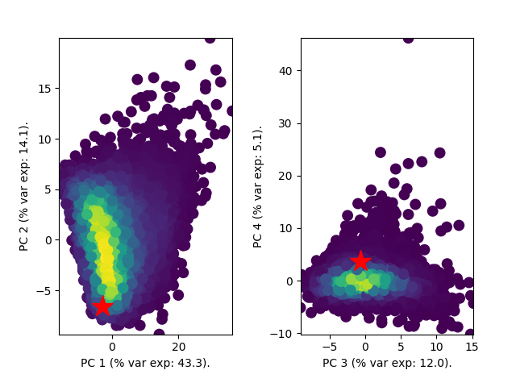
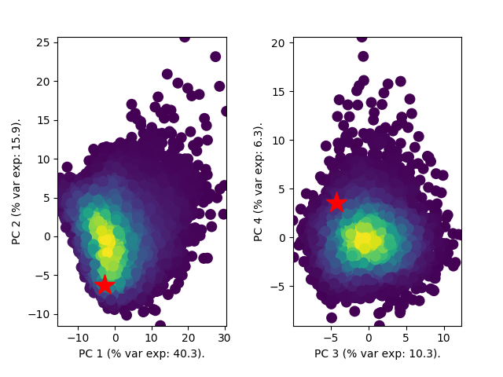

# PhyloDeep

PhyloDeep is a python library for parameter estimation and model selection from phylogenetic trees, based on deep learning.

For more information on the method, please refer to the preprint here: 

## Installation

PhyloDeep is available for Python 3.6 on [pip](https://pypi.org/project/phylodeep).


### Windows
For **Windows** users, we recommend installing __phylodeep__ via [Cygwin environment](https://www.cygwin.com/).
First instal Python 3.6 and pip3 from the Cygwin packages. Then install __phylodeep__:
```bash
pip3 install phylodeep
```

### All other platforms

You can install __phylodeep__ for Python 3.6 with or without [conda](https://conda.io/docs/), following the procedures described below:

#### Installing with conda

Once you have conda installed, create an environment for __phylodeep__ with Python 3.6 (here we name it phyloenv):

```bash
conda create --name phyloenv python=3.6
```

Then activate it:
```bash
conda activate phyloenv
```

Then install __phylodeep__ in it:

```bash
pip install phylodeep
```

#### Installing without conda

Make sure that Pyhon 3.6 and pip3 are installed, then install __phylodeep__:

```bash
pip3 install phylodeep
```

## Usage 

If you installed __phylodeep__ with conda, do not forget to activate the corresponding environment (e.g. phyloenv) before using PhyloDeep:
```bash
conda activate phyloenv
```


We recommend to perform a priori model adequacy first to assess whether the input data resembles well the 
simulations on which the neural networks were trained.

### Python

```python
import phylodeep
from phylodeep import BD, BDEI, BDSS, SUMSTATS, FULL

path_to_tree = './Zurich.trees'

# set presumed sampling probability
sampling_proba = 0.25

# a priori check for models BD, BDEI, BDSS
model_BD_vs_BDEI = phylodeep.checkdeep(path_to_tree, model=BDSS)


# model selection
model_BDEI_vs_BD_vs_BDSS = phylodeep.modeldeep(path_to_tree, sampling_proba, vector_representation=FULL)

# the selected model is BDSS

# parameter inference
param_BDSS = phylodeep.paramdeep(path_to_tree, sampling_proba, model=BDSS, vector_representation=FULL, 
                                 ci_computation=True)

```

### Command line

```python

# we use here a tree of 200 tips

# a priori model adequacy check: highly recommended
checkdeep -t ./Zurich.trees -m BD -o BD_model_adequacy.png
checkdeep -t ./Zurich.trees -m BDEI -o BDEI_model_adequacy.png
checkdeep -t ./Zurich.trees -m BDSS -o BDSS_model_adequacy.png

# model selection
modeldeep -t ./Zurich.trees -p 0.25 -v CNN_FULL_TREE -o model_selection.csv

# parameter inference
paramdeep -t ./Zurich.trees -p 0.25 -m BDSS -v CNN_FULL_TREE -o HIV_Zurich_BDSS_CNN.csv
paramdeep -t ./Zurich.trees -p 0.25 -m BDSS -v FFNN_SUMSTATS -o HIV_Zurich_BDSS_FFNN_CI.csv -c
```

### Example of output and interpretations
Here, we use an HIV tree reconstructed from 200 sequences, published in Phylodynamics on local sexual contact networks 
by Rasmussen et al in PloS Computational Biology in 2017, and that you can find at [github](./test_tree_HIV_Zurich/Zurich.trees)

The a priori model adequacy check results in the following figures:

#### BD model adequacy test


#### BDEI model adequacy test


#### BDSS model adequacy test


For the three models (BD, BDEI and BDSS), HIV tree datapoint (represented by a red star) is well inside the data cloud
of simulations, where warm colors correspond to high density of simulations. The simulations and HIV tree datapoint were
in the form of summary statistics prior to applying PCA. All three models thus pass the model adequacy check.

We then apply model selection using the full tree representation and obtain the following result:

| Model | Probability BDEI | Probability BD | Probability BDSS |
| -------- | ------------- | ------------- | ------------- |
| __Predicted probability__ | 0.00 | 0.00 | 1.00 |

The BDSS probability is by far the highest: it is the BDSS model that is confidently selected

Finally, under the selected model BDSS, we predict parameter values together with 95% CIs:

|  |  R naught  |  Infectious period  |  X transmission  |  Superspreading fraction  |
| ------------- | ------------- | -------------  |  -------------  | ------- |
| __predicted value__ | 1.69 |  9.78  | 9.34  |  0.079  |
| __CI 2.5%__  |  1.40  |  8.12  |  6.65  |  0.050  |
| __CI 97.5%__  |  2.08  |  12.26  |  10  |  0.133  |

The point estimates for parameters that are no time related (R naught, X transmission and Superspreading fraction) are
well inside the parameter ranges of simulations and thus seem valid.

## Citation


## Contributing


## License
