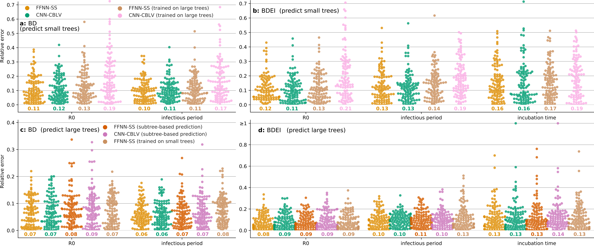

# PhyloDeep Data for Supp Figure 4 "Assessment of deep learning generalization capabilities "

This folder contains data and pipelines used for the Supp Figure 4 in the following PhyloDeep manuscript:
Voznica J, Zhukova A, Boskova V, Saulnier E, Lemoine F, Moslonka-Lefebvre M, Gascuel O (2021)
__Deep learning from phylogenies to uncover the transmission dynamics of epidemics__. [bioRxiv](https://www.biorxiv.org/content/10.1101/2021.03.11.435006v1)

